# Protocol Health — Full Architecture

## 1. System Overview

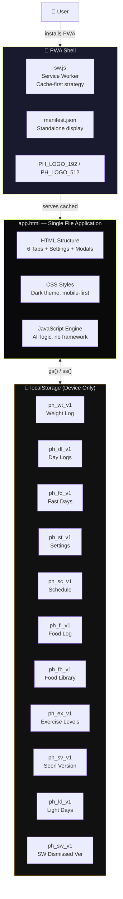

---

## 2. Initialization Flow

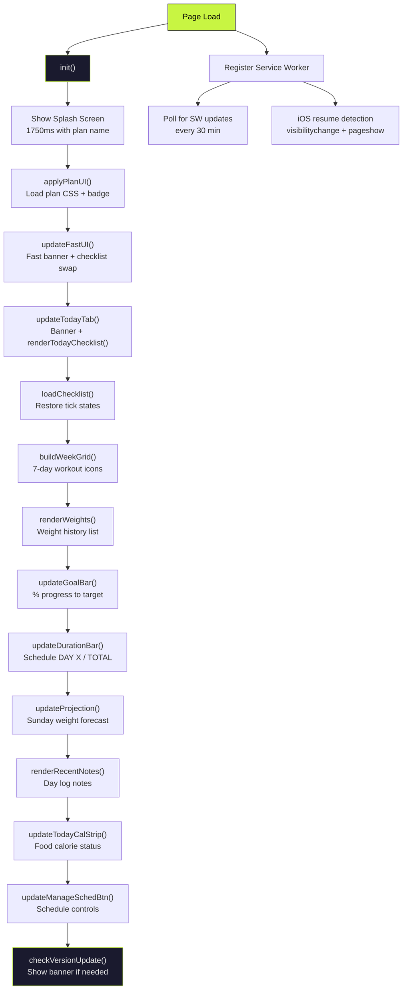

---

## 3. Central Dispatcher — The Nervous System

Every data write ends with `dispatch("EVENT")`. The dispatcher is the **only** bridge between data mutations and UI updates.

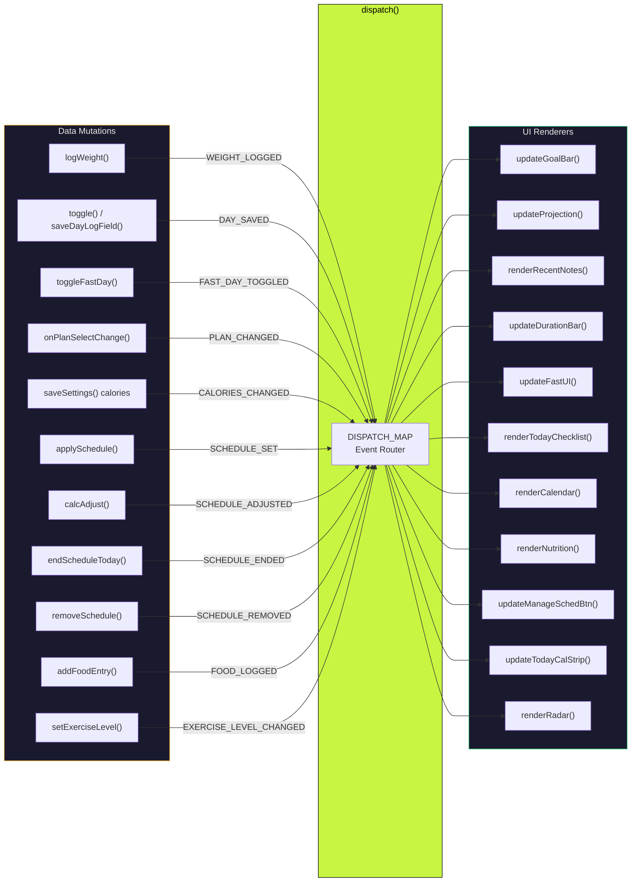

### Dispatch Event Map

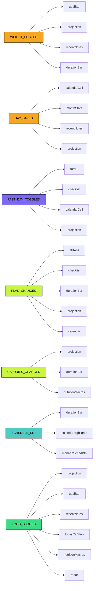

---

## 4. Plan System — Content Gateway

```mermaid
flowchart TD
    SETTINGS["getSettings()<br/>settings.plan = 'default' | 'agro' | 'cut' | 'bulk' | 'maintenance'"]
    GAP["getActivePlan()<br/>Returns PLANS[key]"]

    SETTINGS --> GAP

    subgraph PLANS_OBJ["PLANS Object — 5 Plans"]
        P1["PLANS.default<br/>Sustainable cut<br/>3 fast days, 1500 cal"]
        P2["PLANS.agro<br/>Aggressive cut<br/>3 fast days, 1000 cal"]
        P3["PLANS.cut<br/>Flexible deficit<br/>0 fast days, macro-aware"]
        P4["PLANS.bulk<br/>Clean surplus<br/>0 fast days, carb-forward"]
        P5["PLANS.maintenance<br/>Sustain weight<br/>0 fast days, balanced"]
    end

    GAP --> PLANS_OBJ

    subgraph PLAN_FIELDS["Each Plan Contains"]
        ID["Identity<br/>name, badge, badgeClass, descClass, subtitle"]
        PROTO["Protocol Numbers<br/>tdee, fastDaysPerWeek, fastDaysDow"]
        STYLE["Banner Styling<br/>bannerColor, bannerBg, bannerBorder"]
        CK_DATA["Checklist Arrays<br/>checklistNormal[], checklistFast[]"]
        DAY_SUB["Day Sub-text<br/>morningSub{}, eveningSub{}, stretchSub{}"]
        MACROS["Macro Config<br/>macroSplit{}, proteinFloorMultiplier"]
        CONTENT["Content Generators<br/>workoutContent(), nutritionContent(), rulesContent()"]
    end

    PLANS_OBJ --> PLAN_FIELDS

    subgraph CONSUMERS["Plan Consumers"]
        C1["TODAY tab<br/>Banner + Checklist"]
        C2["WORKOUTS tab<br/>workoutContent()"]
        C3["NUTRITION tab<br/>nutritionContent()"]
        C4["RULES tab<br/>rulesContent()"]
        C5["MONTHS calendar<br/>fastDaysDow for auto-set"]
        C6["Goal Calculator<br/>tdee, fastDaysPerWeek"]
        C7["Projection<br/>tdee, fast day count"]
        C8["computeMacros()<br/>macroSplit, proteinFloorMultiplier"]
    end

    PLAN_FIELDS --> CONSUMERS

    style GAP fill:#c8f542,stroke:#000,color:#000
    style PLANS_OBJ fill:#1a1a2e,stroke:#c8f542,color:#e8e8e8
    style CONSUMERS fill:#111111,stroke:#3ddc84,color:#e8e8e8
```

---

## 5. Tab Architecture

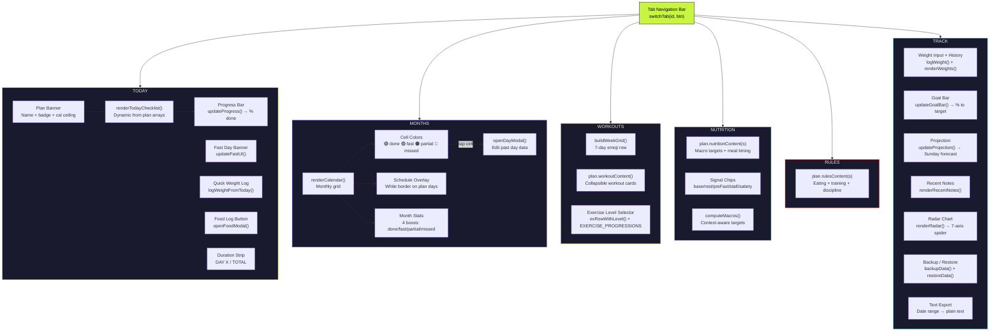

---

## 6. Checklist System

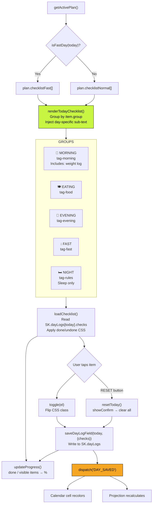

---

## 7. Weight Tracking & Goal Bar

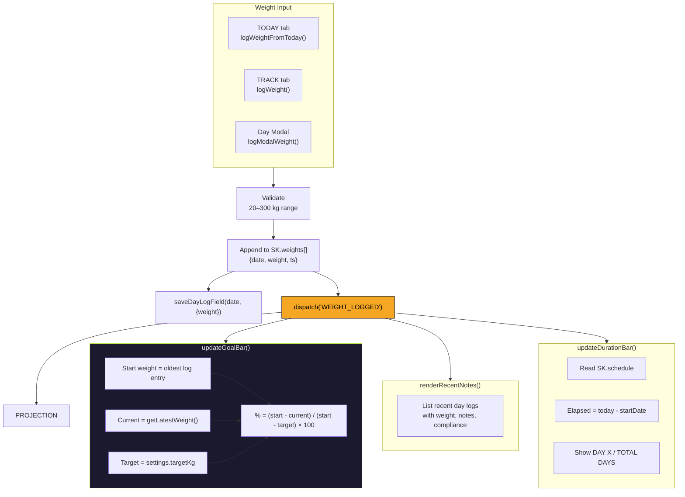

---

## 8. Weight Projection Algorithm

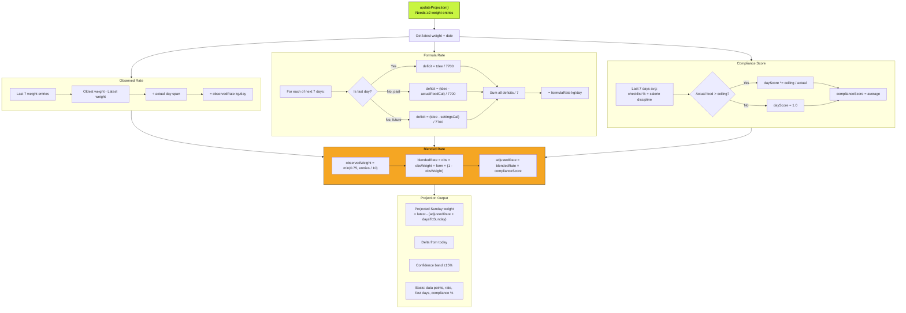

---

## 9. Goal Calculator (Plan-Aware)

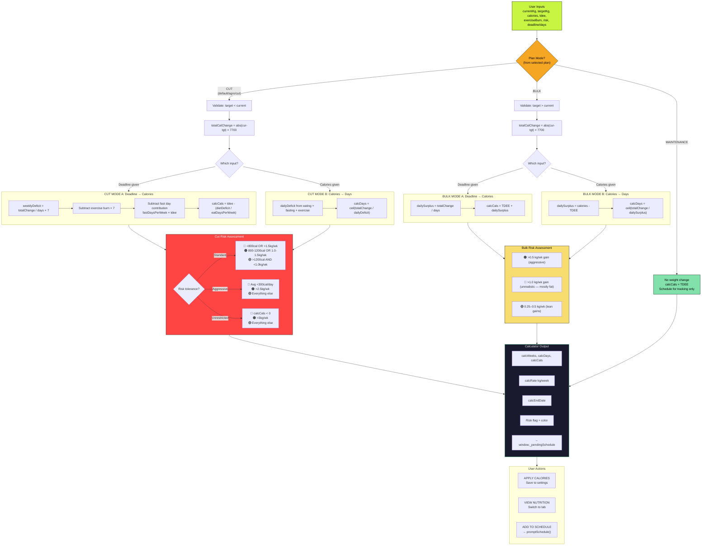

---

## 10. Schedule System

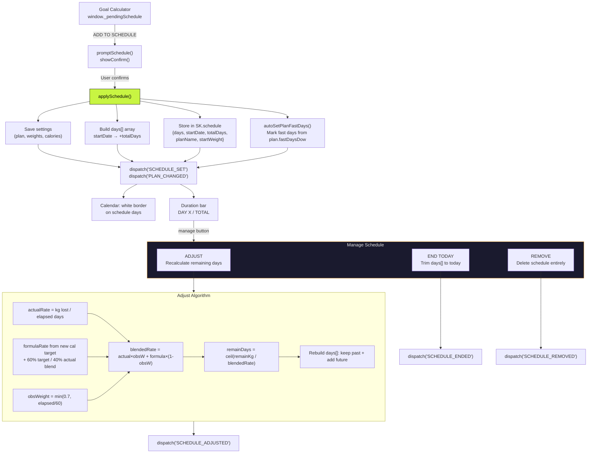

---

## 11. Macro Computation Engine

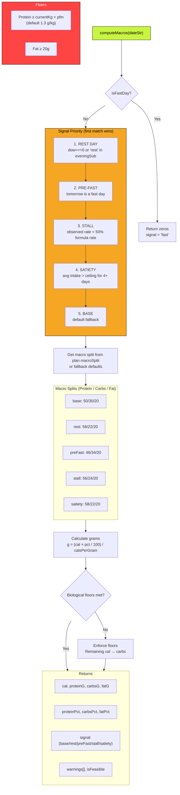

---

## 12. Food Logging & Library

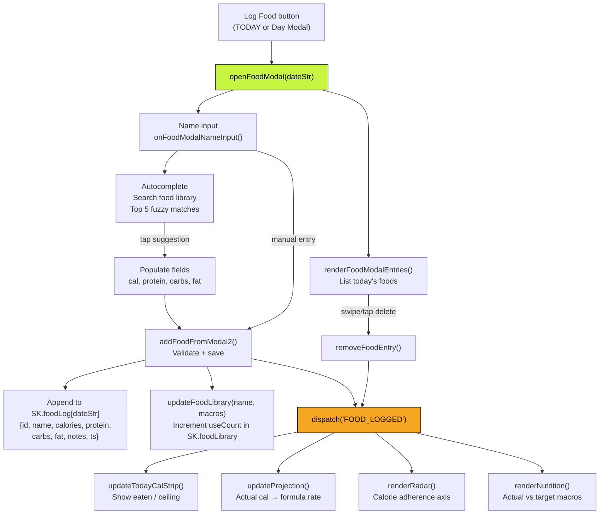

---

## 13. Performance Radar Chart

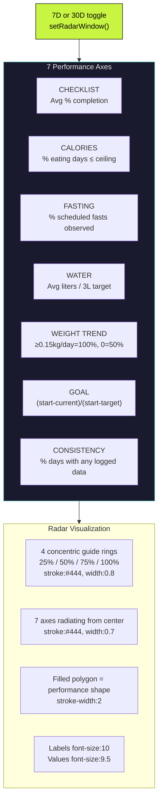

---

## 14. Calendar & Day Modal

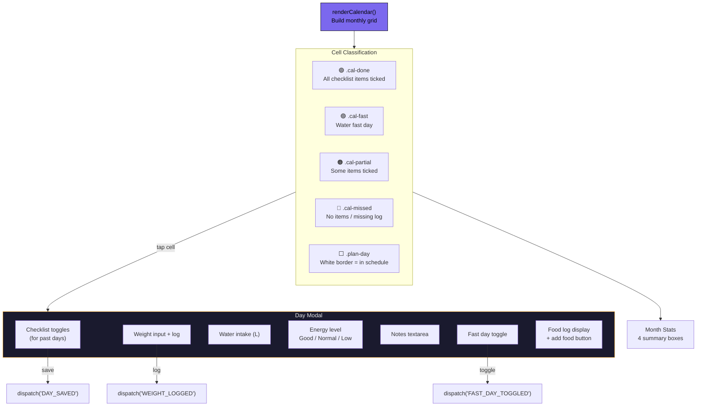

---

## 15. Backup & Restore

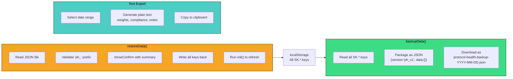

---

## 16. Service Worker Update Flow

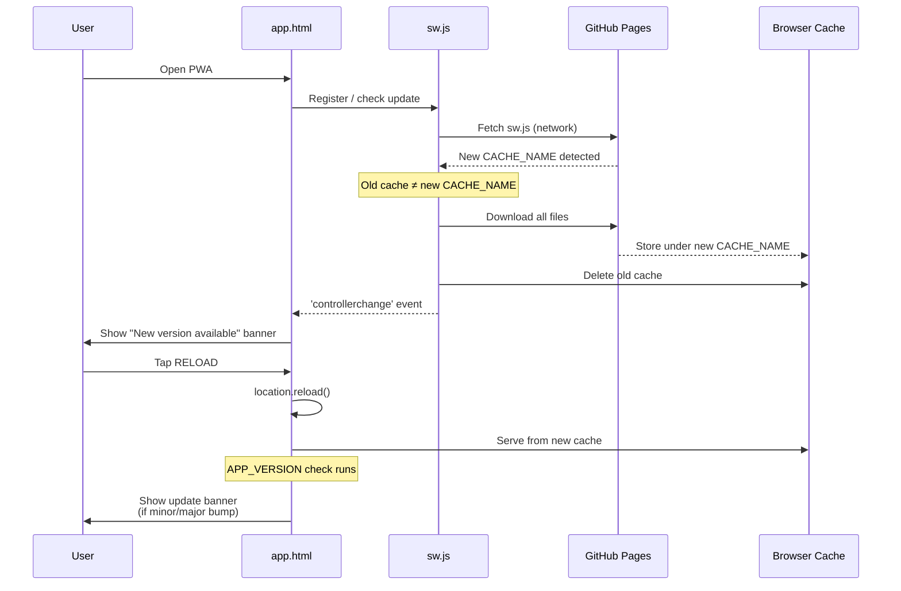

---

## 17. Data Flow — Everything Connected

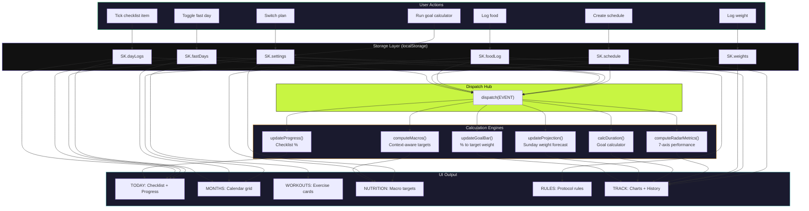

---

## 18. Custom UI Systems

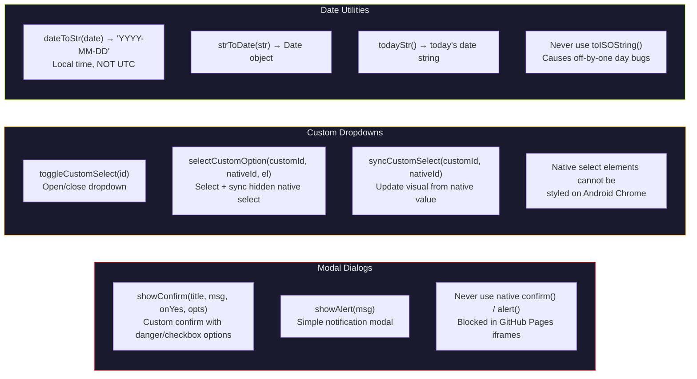
